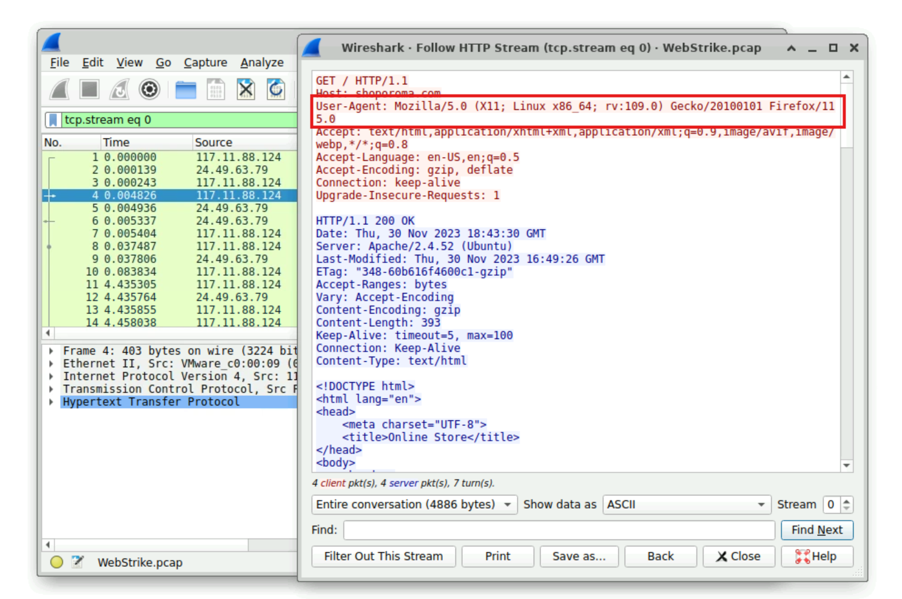
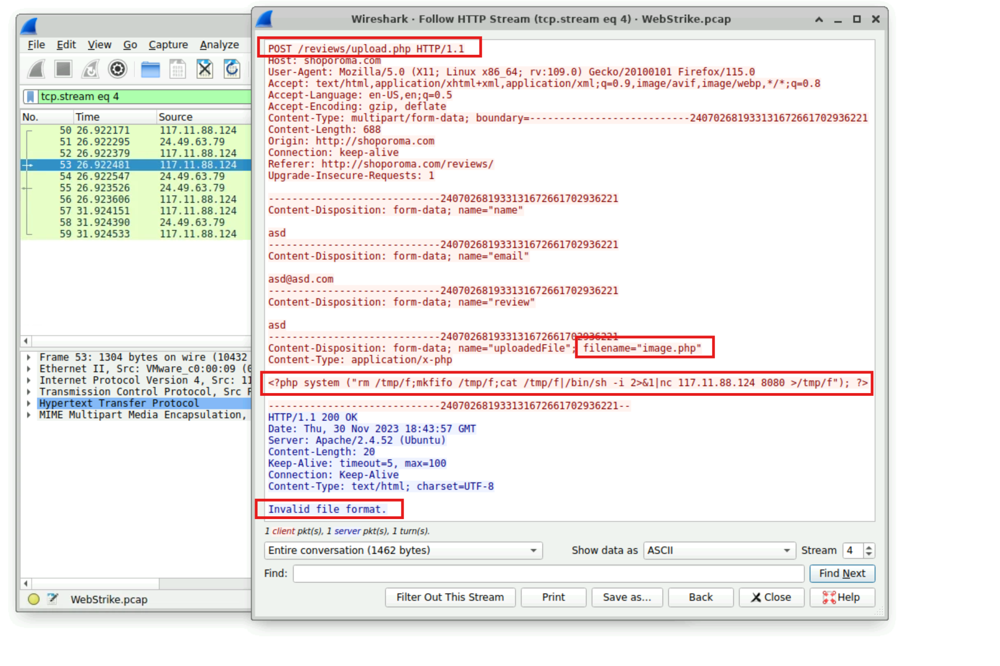
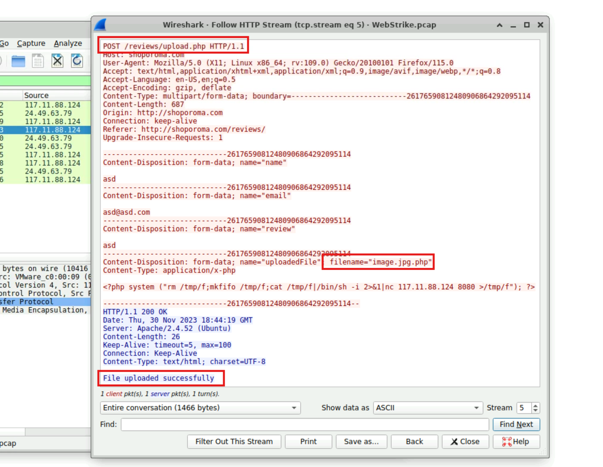
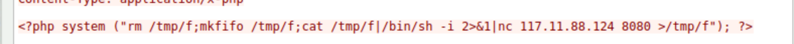
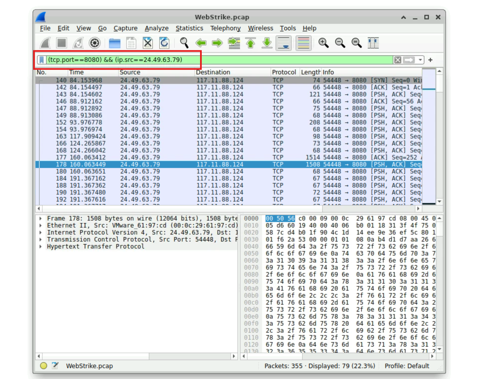
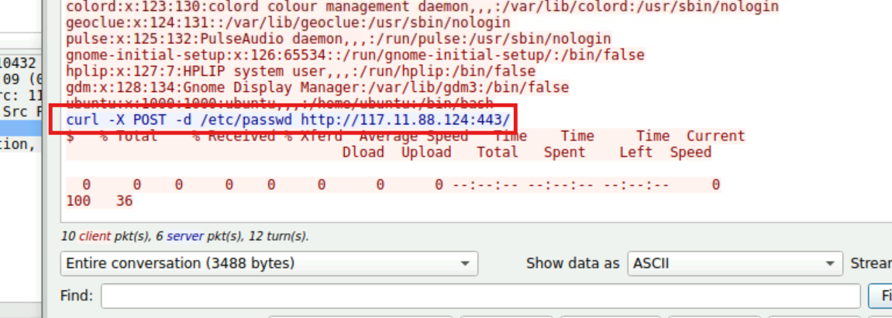

# Web Server Compromise - Network Forensics Analysis
**Category:** Network Forensics

**Platform:** CyberDefenders

**Tool Used:** Wireshark

## Lab Description
Analyze captured network traffic using Wireshark to investigate a web server compromise. The objective is to identify malicious activity including web shell upload, reverse shell communication, and data exfiltration.

## Scenario Summary
A suspicious file was discovered on a company web server, raising concerns of unauthorized access within the internal network. The Development team escalated the issue to security, suspecting a potential breach.

To support the investigation, the Network team captured network traffic related to the incident and provided a PCAP file for forensic analysis.

## Objective:
Analyze the PCAP file to determine:
- Identify the source of the attack
- Determine how the web server was compromised
- Identify attacker tools and techniques
- Assess potential data exfiltration

## Tactics Observed:
- Initial Access
- Execution
- Persistence
- Command and Control (C2)
- Exfiltration

## Intial Traffic Analysis & Attack Origin
The PCAP file was opened in Wireshark to establish an overview of the captured traffic.
Early analysis revealed consistent communication between two IP addresses:
- **24.49.63.79** – Identified as the web server
- **117.11.88.124** – Suspected external attacker

To validate this observation, IPv4 endpoint statistics were reviewed:

The endpoint statistics confirmed a high volume of traffic exchanged between these two hosts.

A geolocation lookup was performed on the suspected attacker IP address to provide contextual threat intelligence:

**Finding:**
The attack originated from Tianjin, China, suggesting an external threat actor operating outside the organization’s network.

## Attacker Identification via HTTP Analysis

To better profile the attacker, HTTP traffic was examined by following relevant HTTP streams.

Inspection of request headers revealed the attacker’s User-Agent string:

`Mozilla/5.0 (X11; Linux x86_64; rv:109.0) Gecko/20100101 Firefox/115.0`

This information can be leveraged for detection rules and future traffic filtering.

## Web Shell Upload & Initial Compromise

To identify exploitation activity, HTTP POST requests originating from the attacker were isolated using the following Wireshark filter:

`ip.src == 117.11.88.124 && http.request.method == "POST"`

Two suspicious POST requests were observed targeting the endpoint `/reviews/upload.php`

### First Upload Attempt
- **Filename:** image.php
- **Result:** Upload failed due to invalid file type

### Second Upload Attempt
- **Filename:** image.jpg.php
- **Result:** Upload successful

By appending a misleading image extension, the attacker bypassed server-side file validation. The uploaded file contained PHP code invoking the system() function to execute operating system commands.

Finding:
The attacker successfully deployed a malicious web shell named image.jpg.php.

## Uploaded File Storage Location
Analysis of the HTTP requests and responses revealed that uploaded files were stored in the /reviews/uploads/ directory

This directory represents a critical point for remediation and forensic preservation.

## Reverse Shell & Command-and-Control Activity
Inspection of the uploaded PHP code revealed the use of Netcat (nc) to establish a reverse shell connection.

The reverse shell connected back to the attacker’s system on port 8080, enabling remote command execution on the compromised server.

## Data Exfiltration Attempt

To analyze post-compromise activity, traffic related to the reverse shell session was isolated:

`tcp.port == 8080 && ip.src == 24.49.63.79`

Reviewing the TCP stream revealed the attacker executing a curl command to exfiltrate system data.

**Finding:**
The attacker attempted to exfiltrate the sensitive system file `/etc/passwd`

This indicates intent to collect user account information from the compromised host.

## Indicators of Compromise (IOCs)

| Type                  | Value             |
| --------------------- | ----------------- |
| Attacker IP           | 117.11.88.124     |
| Compromised Server IP | 24.49.63.79       |
| Malicious File        | image.jpg.php     |
| Upload Directory      | /reviews/uploads/ |
| Reverse Shell Port    | 8080              |
| Exfiltration Target   | /etc/passwd       |

## Security Impact & Recommendations

**Impact**
- Remote code execution achieved
- Persistent access via web shell
- Attempted data exfiltration
- Inadequate file upload validation exposed

**Recommendations**
- Enforce strict server-side file type validation
- Disable execution permissions in upload directories
- Monitor outbound connections for unauthorized ports
- Implement web application firewall (WAF) rules
- Conduct credential and integrity audits post-incident

## Conclusion

This investigation demonstrates how a simple file upload vulnerability can lead to full system compromise. Through network traffic analysis, the attacker’s actions were reconstructed from initial access to attempted data exfiltration. Proper defensive controls and monitoring could have prevented or significantly limited the impact of this attack.

## Investigation & Findings

## Key Takeaways
